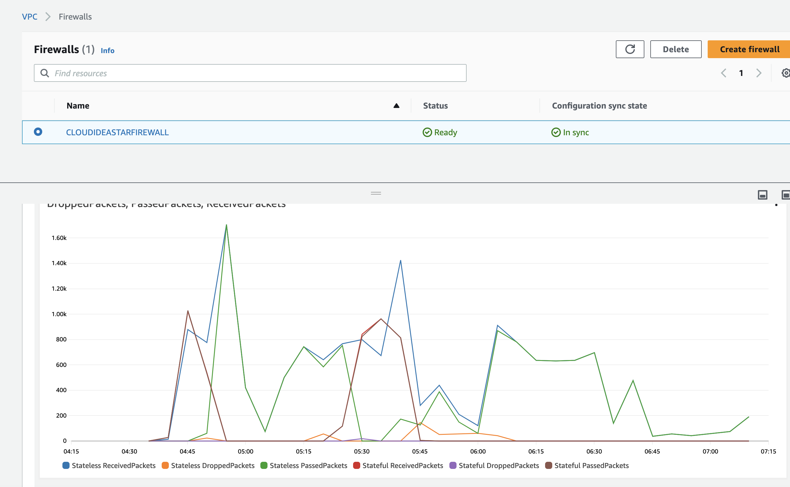

# STEP - 1. Generate the public key


1. Create keypair on aws web - "testing"
2. Download the keypair and generate the keygen on same folder.
  - ssh-keygen -y -f testing.pem

# STEP - 2. After "terraform apply" SSH to EC2 and Install nginx on EC2 amazon linux 2023
```bash
sudo yum search nginx
sudo yum info nginx
sudo yum install nginx
sudo service nginx start
sudo chkconfig nginx on

sudo service nginx status
sudo service nginx start
pgrep nginx
ss -tlpn | grep :80

sudo vi /etc/sysconfig/iptables
-A INPUT -m state --state NEW -m tcp -p tcp --dport 80 -j ACCEPT

sudo service iptables restart
```
# STEP - 3. After spin up , need to update as below

1. IGW Route table associate Edge (Internet Gateway)
2. Endpoint -copy the FW subnet interface ID
3. Add EC2 IP/24 to FW interface on IGW Route Table
4. Change Default route to FW subnet interface ID from IGW on EC2 public route table

### Command to Deploy
```bash
  - terraform init
  - terraform validate
  - terraform plan
  - terraform apply -auto-approve
  - Remove Step -3 configuration, point VCPE (Firewawll subnet Interface ID)
  - terraform destroy -auto-approve
```  





## Test before/after  STEP 3.
1. curl http://10.0.1.xxx/
2. curl http://public_ip
3. http://public_ip
4. SSH to EC2
5. Ping to EC2 (public IP) from PC CMD
