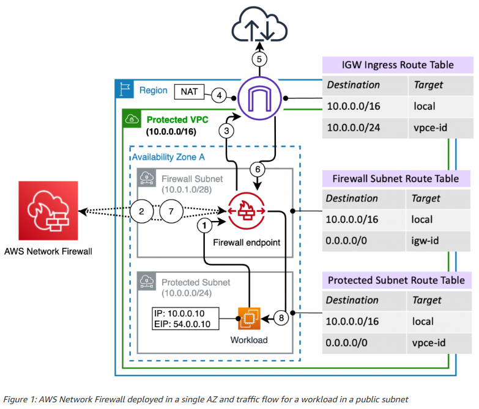

# STEP - 1. Generate the public key


1. Create keypair on aws web - "testing"
2. Download the keypair and generate the keygen on same folder.
  - ssh-keygen -y -f testing.pem
3. Create AWS Profile config/credentials on pc
  - ~/.aws/config
  - ~/.aws/credentials

# STEP - 2. After spin up , need to update as below

1. Git clone 
```bash
git clone https://github.com/phyoww/terraform_AWS_Network_Firewall_deployed_in_a_single_AZ.git
```  
2. Export the aws profile
```bash
export AWS_PROFILE=cloudideastar-devlop
```  

3. Deploy the terraform script.


### Command to Deploy
```bash
  - terraform init
  - terraform validate
  - terraform fmt
  - terraform plan
  - terraform apply -auto-approve
  - terraform state list
  
  - terraform destroy -auto-approve
```  



### Verify
- Check the route table routes
- Check internet route table ,edge association

## Test before/after  STEP 2.
1. curl http://10.0.101.xxx/
2. curl http://public_ip
3. http://public_ip
4. SSH to EC2
5. Ping to EC2 (public IP) from PC CMD
